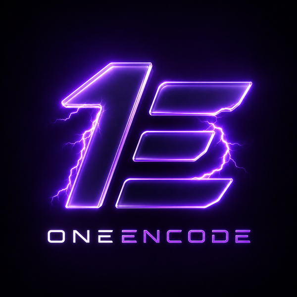

<p align="center">
  
</p>

# OneEncode

A local, one-encode-to-many-transcode restreaming pipeline for Windows: decode a live source **exactly once**, then fan out to as many destination-tuned renditions as you need — each one running as its own isolated, supervised process, and each destination getting the format it actually needs instead of one blind push to everywhere.

## Why

The naive way to push one stream to multiple platforms is to run a fully independent encode process per destination, each pulling and decoding the source separately. Past 1080p that redundant decode load causes real dropped frames once a few destinations are running at once, and different platforms have inconsistent support for high-resolution ingest in the first place — sending everyone the same stream isn't the right move even before the performance problem shows up.

OneEncode decodes the source once and splits the decoded frames into per-rendition encode branches inside a single FFmpeg process, so N destinations no longer mean N redundant decodes. Every actual destination is still a fully separate, independently-restartable OS process, so one platform going down or a bad connection can't take the others with it.

## Features

- **Single decode, many renditions** — one FFmpeg process decodes the source once and splits it (`-filter_complex split`) into as many resolution/bitrate/codec profiles as you configure.
- **Rendition dedup** — two destinations that want the identical profile (resolution/fps/bitrate/codec) automatically share one encode branch instead of paying for it twice.
- **Per-destination failure isolation** — each destination leg is its own OS process; a platform dropping the connection or a write blocking never touches the others.
- **Encoder fallback with a real, probed ceiling** — NVENC → AMF → CPU (`libx264`/`libx265`), walked per rendition. The NVENC concurrent-session ceiling is measured on your actual machine/driver (`npm run probe:nvenc`), never assumed.
- **Local web dashboard** — live per-leg status (fps/bitrate/dropped+duplicated frames), rendition and leg CRUD, and stop/restart controls, bound to `127.0.0.1` only and gated behind a local auth token.
- **Hot-reload, non-destructively** — edit `config/legs.local.yaml` by hand or through the dashboard and it applies automatically within about a second, restarting only what actually needs it (never the whole app). Dashboard writes edit the specific item you touched in place, so hand-added comments elsewhere in the file survive; every write is atomic. An `rtmp-push` leg always lands staged after any edit, even if it was live — never a silent auto-resumed broadcast.
- **Manual broadcast-arm safety gate** — every destination leg that pushes to a real platform starts staged, not running, even if enabled in config. Nothing reaches a real platform until you arm broadcasting and hit "Go Live" on that leg. Disarming immediately stops every live push.
- **Structured, size-bounded logging** — both the JSON-Lines event log and the always-on console mirror rotate past a size cap and prune old files, so a long-running install's `logs/` directory doesn't grow without bound.
- **Standalone, click-and-run Windows release** — `npm run package:win` produces a folder with `oneencode.exe` plus every runtime dependency bundled alongside it (Node itself, the built dashboard, MediaMTX, and FFmpeg) — nothing to install on the target machine.
- **Zero-config first run** — no `config/legs.local.yaml` yet? A safe default (one local-file leg, no real credentials needed) is generated automatically so the app starts and proves the pipeline works, with a dashboard banner pointing you at real setup.

## How it fits together

```
OBS (or any RTMP encoder)
   │  RTMP
   ▼
MediaMTX  ── ingest ──▶  single decode + rendition-split FFmpeg process
                              (one decode; -filter_complex split into N branches)
                                   │              │
                                   ▼              ▼
                          rendition: 1080p60   rendition: 720p60   ← one encode branch
                                   │              │                  per UNIQUE profile
                          published back to MediaMTX, one path per rendition
                                   │              │
                    ┌──────────────┼──────┐       ▼
                    ▼              ▼      ▼   leg: local archive
              leg: platform A  leg: platform B   (stream-copy, own process)
               (stream-copy,    (stream-copy,
                own process)     own process)
```

A local web dashboard (Express + WebSocket backend, React frontend, `127.0.0.1`-only, token-gated) sits alongside the same orchestrator process — live status, config CRUD, and the broadcast-arm control described above.

## Requirements

**Standalone release build** (`npm run package:win`, or a downloaded release .exe): just Windows. FFmpeg, MediaMTX, and Node itself are all bundled — click `oneencode.exe` and go, nothing else to install (see [Licensing](#license) for what that bundling means for each dependency's own license).

**Running from source** (`npm run dev`):
- Windows
- [FFmpeg](https://ffmpeg.org/) on `PATH`, built with NVENC/AMF support if you want hardware encode — not committed to this repo, install it yourself
- Node.js 20+
- [MediaMTX](https://github.com/bluenviron/mediamtx) — download it yourself and place the binary at `tools/mediamtx/mediamtx.exe` (gitignored, not committed to the repo, and not auto-fetched by any script here — see [`docs/GETTING_STARTED.md`](docs/GETTING_STARTED.md) for the exact steps)

Either way: an NVIDIA and/or AMD GPU for hardware-accelerated encode; falls back to `libx264`/`libx265` on CPU otherwise.

## Quick start

Using a standalone release build instead? Skip straight to unzipping it and running `oneencode.exe` — no config to copy first, see below. Everything below is for running from source.

```bash
npm install
npm run web:install        # dashboard frontend deps
npm run web:build          # build the dashboard frontend

npm run probe:nvenc        # measure this machine's real NVENC session ceiling

npm run dev                # start the orchestrator + dashboard
```

No `config/legs.local.yaml`? OneEncode auto-generates a safe default on first run (one local-file leg, no real credentials needed) so it starts either way — the dashboard shows a banner when you're on it. To set up real destinations instead of the default:

```bash
cp config/legs.example.yaml config/legs.local.yaml
cp config/secrets.local.example.yaml config/secrets.local.yaml
# edit both with your real renditions/legs/destination URLs — never commit these
# changes apply automatically within a second (hot-reload) — no restart needed
```

Then open the dashboard (`http://127.0.0.1:4771` by default) and use the local auth token generated on first run to log in.

`config/legs.local.yaml` and `config/secrets.local.yaml` are gitignored on purpose — real destination URLs and stream keys never get committed. `config/legs.example.yaml` documents the full schema with placeholder values, including two destinations deliberately sharing one rendition to demonstrate the dedup path.

For a full walkthrough (including the standalone-exe path and going live end to end), see [`docs/GETTING_STARTED.md`](docs/GETTING_STARTED.md). Config field reference: [`docs/CONFIGURATION.md`](docs/CONFIGURATION.md). Common problems and fixes: [`docs/TROUBLESHOOTING.md`](docs/TROUBLESHOOTING.md).

## Platform support

- **YouTube, Twitch, Kick** — live-tested working `rtmp-push` legs.
- **Local file archival** — works for any rendition, no platform account needed.
- **TikTok LIVE** — investigated, not implemented. TikTok has no open self-serve RTMP signup: access requires either an in-app "LIVE Studio" flow (follower-threshold gated, issues a new session key every broadcast rather than a stable credential) or an external creator-agency relationship, and third-party PC streaming tools face an ongoing content-mix compliance requirement on top of that. Not a code limitation — tracked as a real, unresolved external constraint.
- Any other RTMP-based platform can be added by pointing a `rtmp-push` leg at its ingest URL — the pipeline doesn't hardcode a platform list.

## Known limitations

- **H.264 only, right now.** HEVC/AV1 aren't offered because of a real, current limitation in the bundled MediaMTX version: it accepts Enhanced RTMP (HEVC/AV1) on ingest but refuses to serve it back out over RTMP, and every rendition here gets read back out via RTMP. This is a MediaMTX limitation as of the version in use, not a fundamental RTMP protocol limitation — worth re-checking against future MediaMTX releases.
- **Designed for two machines, not one.** The primary target is a dedicated gaming PC (runs only the game/capture) plus a separate streaming PC (runs OBS and OneEncode) — the gaming machine never carries any transcode load. A single-machine setup works as a fallback, but more than roughly two concurrent encode paths on one machine has caused real contention/lag in testing.
- **NVENC session limits vary by GPU and driver.** Consumer NVIDIA cards have historically capped concurrent hardware-encode sessions. Always run `npm run probe:nvenc` on your own machine rather than assuming a number — the pipeline uses whatever ceiling it actually measures.

## Performance

Live-tested on a streaming PC with an RTX 2080 Ti: a synthetic 2560×1440@60 source scaled from 1 to 10 concurrent renditions, sampling CPU and NVENC/NVDEC utilization at each step (v0.1.0 vs. v0.2.0, same machine, same probed NVENC ceiling).

| Renditions | CPU (v0.1.0) | CPU (v0.2.0) | NVDEC (v0.1.0) | NVDEC (v0.2.0) | Restarts |
|---|---|---|---|---|---|
| 1  | 15.0% | 8.8%  | 0% | 36.0% | 0 |
| 4  | 24.6% | 12.2% | 0% | 11.8% | 0 |
| 8  | 36.0% | 13.8% | 0% | 11.9% | 0 |
| 10 | 30.9% | 13.2% | 0% | 9.9%  | 30 (both) |

v0.2.0's auto-detected GPU decode (see Features above) cuts average CPU load roughly in half at every step and is the only version that ever touches the NVDEC engine. Both versions hit the same wall at 10 concurrent renditions — NVENC saturates at 100% and the restart supervisor kicks in identically either way, since that's a hardware ceiling on the encode chip itself, not something either version's software changes. Zero dropped frames in every single run, including the ones that eventually restarted. On this GPU, **8 concurrent renditions is the practical safe ceiling** at 1080p–1440p60 profiles.

## Not a cloud service

OneEncode runs entirely on your own machine(s) — there's no third-party service in the data path between your encoder and each destination platform. This is a different tradeoff than a hosted multistreaming SaaS: you manage your own FFmpeg/MediaMTX/Node install and your own credentials, in exchange for not routing your stream through someone else's servers.

## Development

```bash
npm test                   # vitest unit suite
npm run bench:baseline     # naive per-destination baseline benchmark
npm run bench:oneencode    # single-decode/dedup design benchmark
```

## License

Source-available under a custom license — see [`LICENSE`](./LICENSE). Free to use, modify, and fork; the source may never be sold, paywalled, or otherwise charged for by anyone but the copyright holder. This does not meet the OSI's formal "open source" definition (which forbids restricting commercial use) — "source-available" is the accurate term here. Distribution must retain attribution and a link back to this repository. Using OneEncode to push to any platform still requires your own account and agreement to that platform's own terms — no rights to any third-party platform's trademarks/APIs/services are granted by this license.

**Third-party components — not bundled in the git repo itself, but bundled into standalone release builds** (`npm run package:win`) for a click-and-run install:
- [MediaMTX](https://github.com/bluenviron/mediamtx) (MIT License) — the local relay server. Permissive license, no redistribution concerns; bundled as-is with its license file alongside it.
- [FFmpeg](https://ffmpeg.org/) — license depends on build configuration; a release build compiled with `--enable-gpl` (needed for the `libx264`/`libx265` CPU fallback encoders) is GPLv3. Bundled release builds include the GPL license text and a source-availability notice (FFmpeg's own source is always public upstream) alongside the binary. OneEncode invokes ffmpeg as a separate child process, not as a linked library, so this doesn't affect OneEncode's own license.

Both are required external dependencies when running from source (`npm run dev`) — see [Requirements](#requirements).
